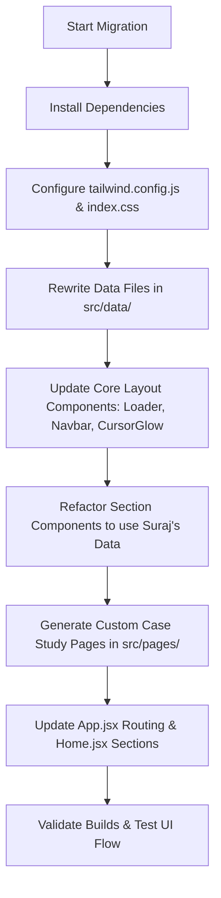

# Portfolio Transformation Analysis & Implementation Plan

This document outlines the analysis of **Prashant Mane's Portfolio (V2)** and defines a comprehensive plan to redesign **Suraj Karande's Portfolio** using the exact same premium visual structure, design mechanisms, and modular code architecture, while populating it entirely with Suraj's personal content.

---

## 1. Prashant Mane's Portfolio: Detailed Analysis

### A. Project Structure
The project is built on **React** (v18.3.1) and **Vite** as the build tool, utilizing **Tailwind CSS** for layout and style configuration. The source code is organized into modular directories:

```
src/
├── assets/             # Images and static graphic media
├── components/         # Global reusable UI elements
│   ├── BackToTop.jsx
│   ├── Button.jsx
│   ├── CursorGlow.jsx
│   ├── Footer.jsx
│   ├── Loader.jsx
│   ├── Navbar.jsx
│   ├── ScrollProgressBar.jsx
│   └── SectionHeading.jsx
├── data/               # Content separation files (Single Source of Truth)
│   ├── experience.js
│   ├── profile.js
│   ├── projects.js
│   ├── skills.js
│   └── social.js
├── hooks/              # Custom React hooks for DOM & scrolling
│   ├── useActiveSection.js
│   └── useScrollProgress.js
├── pages/              # Main view templates and project case studies
│   ├── Home.jsx
│   ├── NotFound.jsx
│   ├── ProjectDetailAITrip.jsx
│   └── ProjectDetailEMS.jsx
├── sections/           # Section-by-section home page building blocks
│   ├── About.jsx
│   ├── Certifications.jsx
│   ├── Contact.jsx
│   ├── Experience.jsx
│   ├── GithubStats.jsx
│   ├── Hero.jsx
│   ├── Projects.jsx
│   ├── Services.jsx
│   └── Skills.jsx
├── App.jsx             # Main router and layout assembly wrapper
├── index.css           # Global custom classes (custom scrollbar, glassmorphism)
└── main.jsx            # React root mount script
```

### B. Styling & Design Theme
* **Theme**: Deep dark mode interface.
* **Palette**:
  * Base Background: `#09090B` (Zinc-950)
  * Card Backgrounds: `#18181B` (Zinc-900)
  * Primary Accent: `#3B82F6` (Blue-500)
  * Secondary Accent: `#60A5FA` (Blue-400)
  * Body Text: `#F8FAFC` (Slate-50)
  * Muted Text: `#94A3B8` (Slate-400)
* **Visual Effects**:
  * **Glassmorphism**: Tailwind classes combined with a custom `.glass` class that applies `backdrop-filter: blur(14px)` and a subtle transparent white border.
  * **Ambient Glows**: Blur filters (`blur-[100px]`, `blur-[120px]`) on absolute positioned colored circles in the background that animate (float) behind content.
  * **Grid Overlays**: Custom grid background patterns via linear gradients (`.grid-bg`).
* **Typography**:
  * Display Header Font: *Space Grotesk*
  * Body Font: *Inter*
  * Code/Mono Font: *JetBrains Mono*

### C. Design Mechanisms & Code Module Setup
* **Animations (Framer Motion)**: Used for enter transitions, lazy scroll fades (`whileInView`), loading exit fades, and menu slide-ins.
* **Hero Text Animation**: `react-type-animation` cycles through professional roles.
* **Scrolling Logic**: `react-scroll` elements coordinate with a custom hook (`useActiveSection.js`) to trigger active highlights in the Navbar as the user scrolls.
* **Interactive Loader**: A typing simulation in the `Loader` component blocks the screen for 900ms before revealing the page.
* **Dynamic GitHub Stats**: Performs an API fetch to calculate public repositories and stars dynamically, and renders graphical summary cards from `github-profile-summary-cards`.
* **Contact Integration**: Validates input fields client-side, showing alerts via `react-toastify`, and attempts to send email using `@emailjs/browser`.

---

## 2. Comparison: Suraj vs. Prashant

| Attribute | Suraj Karande's Current Portfolio | Prashant Mane's Portfolio (Target Design) |
| :--- | :--- | :--- |
| **Tech Stack** | React (Vite) - 0 dependencies besides React | React (Vite) + Tailwind CSS, Framer Motion, Lucide, React Icons, React Scroll, React Type Animation, Swiper, EmailJS, React Toastify |
| **File Structure** | Monolithic: Entire app in `src/App.jsx`, styles in `src/index.css` | Modular: Separated components, sections, pages, hooks, and single-source data files |
| **Styling** | Plain custom CSS (73 KB), tabular-like header, dark panel with solid borders | Tailwind CSS classes + CSS Variables, glassmorphic layout, dynamic glowing backgrounds, gradient borders |
| **Aesthetics** | Simple tabs with clean grid. Lacks modern interactions, hover micro-animations, or active scroll highlights. | Rich dark theme, glowing cursor light, top scroll progress bar, float animations, smooth view reveals. |
| **Project Presentation** | Minimal grid cards showing summary and GitHub link. | Filterable grid search + Detailed Case Study pages with screenshots, architecture maps, and challenges. |
| **Contact System** | FormSubmit.co placeholder (currently commented out) | Configured client-side validator + React Toastify notices + EmailJS integration |

---

## 3. Translation Plan: Mapping Suraj's Data to Modular Structure

We will migrate all data from Suraj's current `App.jsx` into the clean data structure of Prashant's code.

### A. Data Module Mapping (`src/data/`)

#### 1. `profile.js`
We will replace Prashant's profile with Suraj's metadata:
```javascript
export const profile = {
  name: 'Suraj Karande',
  roles: ['Java Full Stack Developer', 'Backend Developer', 'Software Engineer'],
  location: 'Pune, Maharashtra, India',
  phone: '+91 8856007451', // Keep or blank out if unspecified, or request from user
  email: 'surajdkarande6396@gmail.com',
  github: 'https://github.com/SurajKarande01',
  linkedin: 'https://www.linkedin.com/in/surajk0001/',
  resumeUrl: '/Resume_Suraj_Karande.pdf',
  summary: "I am a Java Full-Stack Developer who loves building secure, clean, and highly efficient web applications. I focus on backend engineering with Java, Spring Boot, Spring Security, and Hibernate, and integrate them with responsive React.js frontends...",
  tagline: "I build secure, scalable backend architectures with Java, Spring Boot, and Microservices, integrated with modern, responsive React frontends."
}
```

#### 2. `skills.js`
We will group Suraj's skills into categorized cards matching the progress bars:
* **Frontend**: React.js (80%), JavaScript (ES6+) (85%), Tailwind CSS (90%), HTML5 & CSS3 (85%)
* **Backend**: Java 17 (90%), Spring Boot (85%), Spring Security & JWT (80%), REST APIs & Microservices (90%)
* **Database**: MySQL & JPA ORM (85%), PostgreSQL (80%)
* **DevOps & Tools**: Docker (70%), Git & Version Control (90%), Postman & Swagger UI (90%), Maven (85%)

#### 3. `projects.js`
Suraj has 8 robust projects. We will structure them with tags:
* `AuthApp — Authentication System` (Featured -> Detail page)
* `Feasto — E-Commerce Platform` (Featured -> Detail page)
* `SAMS Track — Attendance Portal` (Featured -> Detail page)
* `Store Rating & Reviews Platform` (Featured -> Detail page)
* `ProTaskify — Task Management System` (Regular)
* `Study_Mate — Student-Tutor Platform` (Regular)
* `chat-app — Real-Time Chat System` (Regular)
* `Plant Disease Detection` (Regular)

#### 4. `experience.js`
We will populate this with Suraj's academic & training milestones:
* **Internships / Trainees**:
  * Role: "Java Full Stack Trainee"
  * Org: "Java By Kiran, Pune"
  * Duration: "Jun – Nov 2025"
  * Points: ["Completed hands-on training focused on Java web development.", "Built full-stack capstone projects and designed REST APIs with Spring Boot.", "Worked with Hibernate/MySQL databases and practiced writing clean, modular code."]
* **Education**:
  * Degree: "B.Tech in Computer Science & Tech"
  * School: "Department of Technology, Shivaji University, Kolhapur"
  * Duration: "Aug 2021 – Mar 2025"
  * Score: "CGPA: 6.85 / 10"
* **Certifications**:
  * Online Java Certification Course (IntelliPaat Academy)
  * HTML5 - The Language Course (Infosys Springboard)
  * YUVAAI For All (TCSiON / IndiaAI)
  * Introduction to Large Language Models (Google Cloud)
  * Software Engineering Job Simulation (Commonwealth Bank via Forage)
  * Use Generative AI for Software Development (IBM SkillsBuild)

---

## 4. Implementation Steps (Migration & Refactor)



### Step 1: Install & Verify Missing Packages
Ensure Suraj's dependencies are installed into the portfolio:
* Lucide React / React Icons for consistent iconography.
* Framer Motion for premium animations.
* React Scroll & React Type Animation.

### Step 2: Set Up Styling & Tailwind Configurations
Verify `tailwind.config.js` and `src/index.css` are configured correctly to retain the custom glow effects, scroll animations, font setups (Space Grotesk / Inter), and glassmorphism.

### Step 3: Populate Data Files
Overwrite files in `src/data/` with Suraj's verified portfolio values (Profile, Skills, Journey, Projects).

### Step 4: Adapt Components & Sections
* Update **Loader.jsx**: Change the typing text to match Suraj's name (`const developer = "Suraj Karande"`).
* Update **GithubStats.jsx**: Change `USERNAME = 'prashantmane1207'` to `'SurajKarande01'`.
* Update **Contact.jsx**: Adapt social links and email destinations. Include the EmailJS setup hooks.

### Step 5: Build Detailed Project Case Studies
Create dedicated detailed subpages inside `src/pages/` for Suraj's featured projects:
1. `ProjectDetailAuthApp.jsx`
2. `ProjectDetailFeasto.jsx`
3. `ProjectDetailSAMSTrack.jsx`
4. `ProjectDetailStoreRating.jsx`

Hook these pages up in `src/App.jsx` and match them to the `detailPath` in `src/data/projects.js`.

---

## 5. Feedback Request & Next Steps

> [!IMPORTANT]
> Please review this plan. Specifically:
> 1. Do you want me to proceed with migrating the workspace files directly to this design?
> 2. Do you have your EmailJS service key details, or should I leave them configured to pull from environmental variables (`.env`) like Prashant's setup?
